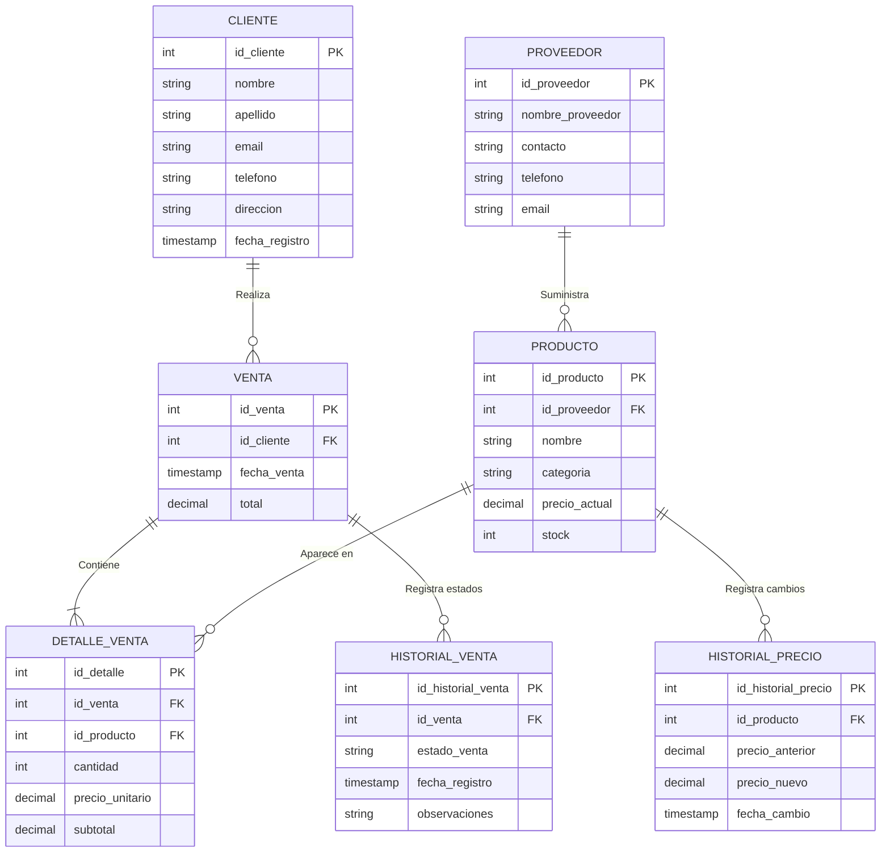

# PyME_Panaderia_Cozi
Diseño e implementación de una aplicación de gestión para la PyME "Panadería Cozi", optimizando el inventario, la gestión de ventas y la reposición de stock.

**PROGRAMACIÓN Y BASE DE DATOS** - Módulo Programador  
**PROFESORES:** Maria Florencia Garcia Zavia  
Enzo Eduardo Bruno
  
**CICLO LECTIVO:** 2026  

### INTEGRANTES Y ROLES:
* **Coordinador:** Rodriguez Sofia Belen y Tula Emiliano 
* **Modelo de datos:** Machado Rebeca Anahi y Miranda Nicolas
* **Interfaz:** Puntano Ezequiel 
* **Acceso a datos:** Parra Alexander 
* **Validaciones:** Parra Alexander 
* **Documentación y pruebas:** Molina Ricardo y Tula Emiliano 

Nombres 

Molina Ricardo
Rodriguez Sofia Belen
Parra Garcia Alexander
Machado Rebeca Anahi
Tula Emiliano 
Puntano Ezequiel
Miranda Nicolas

---

## 📦 ENTIDADES DEL SISTEMA

* **Producto:** Representa el catálogo y el control de inventario.
* **Venta:** Registro de cada transacción realizada.
* **Detalle_venta:** Entidad intermedia para permitir vender varios productos en una sola venta.
* **Cliente:** Registro de clientes recurrentes.
* **Proveedor:** Representa la reposición de stock de los productos finales.
* **Historial_Precio:** Entidad para guardar históricos de cambios en los precios.
* **Historial_Venta:** Permite guardar el registro de los estados de todas las ventas.

---

## 💻 INTERFAZ Y BOCETOS

**Bocetos de pantallas:** [Ver PDF en Google Drive](https://drive.google.com/file/d/1F0he--sNUQXeaUCiHJbi4hC0_SKS13Sk/view?usp=sharing)

**Breve explicación del funcionamiento:**
* **Pantalla dividida en dos:**
  * **Izquierda:** Menú con botones para moverse entre: Productos, Ventas, Clientes, Proveedores y Reportes.
  * **Derecha:** Muestra la pantalla del módulo en el que estés (ej. la lista de productos).
* **Pantalla de Productos:**
  * Tiene un título, un botón para agregar nuevo producto, una barra para buscar y un filtro por categoría.
  * Muestra una tabla con: Código, Producto, Stock y Precio.
  * Abajo tiene botones para Editar o Eliminar el producto que selecciones en la tabla.
* **Tecnología:** Se usa la librería **Tkinter** (Python).
  * La ventana principal tiene funciones para armar el menú, el panel de productos y cargar datos de prueba. Los demás botones por el momento imprimen mensajes en consola para probar su interactividad.

---

## 🗄️ MODELO DE BASE DE DATOS

Este documento contiene el Modelo Entidad-Relación, el Diccionario de Datos y el Script SQL (DDL) normalizados para SQLite.

### 1. Modelo Entidad-Relación (E-R)
*(Nota: GitHub renderiza este diagrama automáticamente)*

    2. Diccionario de Entidades
CLIENTE: id_cliente (PK), nombre, apellido, email, telefono, direccion, fecha_registro

PROVEEDOR: id_proveedor (PK), nombre_proveedor, contacto, telefono, email

PRODUCTO: id_producto (PK), id_proveedor (FK), nombre, categoria, precio_actual, stock

VENTA: id_venta (PK), id_cliente (FK), fecha_venta, total

DETALLE_VENTA: id_detalle (PK), id_venta (FK), id_producto (FK), cantidad, precio_unitario, subtotal

HISTORIAL_PRECIO: id_historial_precio (PK), id_producto (FK), precio_anterior, precio_nuevo, fecha_cambio

HISTORIAL_VENTA: id_historial_venta (PK), id_venta (FK), estado_venta, fecha_registro, observaciones

3. Script SQL (DDL)

-- 1. Tabla: Proveedor
CREATE TABLE proveedor (
    id_proveedor INTEGER PRIMARY KEY AUTOINCREMENT,
    nombre_proveedor VARCHAR(150) NOT NULL,
    contacto VARCHAR(100),
    telefono VARCHAR(20),
    email VARCHAR(150) UNIQUE
);

-- 2. Tabla: Cliente
CREATE TABLE cliente (
    id_cliente INTEGER PRIMARY KEY AUTOINCREMENT,
    nombre VARCHAR(100) NOT NULL,
    apellido VARCHAR(100) NOT NULL,
    email VARCHAR(150) UNIQUE,
    telefono VARCHAR(20),
    direccion TEXT,
    fecha_registro TIMESTAMP DEFAULT CURRENT_TIMESTAMP NOT NULL
);

-- 3. Tabla: Producto
CREATE TABLE producto (
    id_producto INTEGER PRIMARY KEY AUTOINCREMENT,
    id_proveedor INTEGER NOT NULL,
    nombre VARCHAR(150) NOT NULL,
    categoria VARCHAR(100),
    precio_actual DECIMAL(10,2) NOT NULL CHECK (precio_actual > 0),
    stock INTEGER NOT NULL CHECK (stock >= 0),
    CONSTRAINT fk_producto_proveedor 
        FOREIGN KEY (id_proveedor) 
        REFERENCES proveedor(id_proveedor) 
        ON DELETE RESTRICT
);

-- 4. Tabla: Historial de Precio
CREATE TABLE historial_precio (
    id_historial_precio INTEGER PRIMARY KEY AUTOINCREMENT,
    id_producto INTEGER NOT NULL,
    precio_anterior DECIMAL(10,2) NOT NULL,
    precio_nuevo DECIMAL(10,2) NOT NULL,
    fecha_cambio TIMESTAMP DEFAULT CURRENT_TIMESTAMP NOT NULL,
    CONSTRAINT fk_historial_producto 
        FOREIGN KEY (id_producto) 
        REFERENCES producto(id_producto) 
        ON DELETE CASCADE
);

-- 5. Tabla: Venta
CREATE TABLE venta (
    id_venta INTEGER PRIMARY KEY AUTOINCREMENT,
    id_cliente INTEGER NOT NULL,
    fecha_venta TIMESTAMP DEFAULT CURRENT_TIMESTAMP NOT NULL,
    total DECIMAL(12,2) DEFAULT 0.00 NOT NULL,
    CONSTRAINT fk_venta_cliente 
        FOREIGN KEY (id_cliente) 
        REFERENCES cliente(id_cliente) 
        ON DELETE RESTRICT
);

-- 6. Tabla: Detalle de Venta
CREATE TABLE detalle_venta (
    id_detalle INTEGER PRIMARY KEY AUTOINCREMENT,
    id_venta INTEGER NOT NULL,
    id_producto INTEGER NOT NULL,
    cantidad INTEGER NOT NULL CHECK (cantidad > 0),
    precio_unitario DECIMAL(10,2) NOT NULL CHECK (precio_unitario > 0),
    subtotal DECIMAL(12,2) NOT NULL,
    CONSTRAINT fk_detalle_venta 
        FOREIGN KEY (id_venta) 
        REFERENCES venta(id_venta) 
        ON DELETE CASCADE,
    CONSTRAINT fk_detalle_producto 
        FOREIGN KEY (id_producto) 
        REFERENCES producto(id_producto) 
        ON DELETE RESTRICT
);

-- 7. Tabla: Historial de Venta
CREATE TABLE historial_venta (
    id_historial_venta INTEGER PRIMARY KEY AUTOINCREMENT,
    id_venta INTEGER NOT NULL,
    estado_venta VARCHAR(50) NOT NULL,
    fecha_registro TIMESTAMP DEFAULT CURRENT_TIMESTAMP NOT NULL,
    observaciones TEXT,
    CONSTRAINT fk_historial_venta 
        FOREIGN KEY (id_venta) 
        REFERENCES venta(id_venta) 
        ON DELETE CASCADE
);